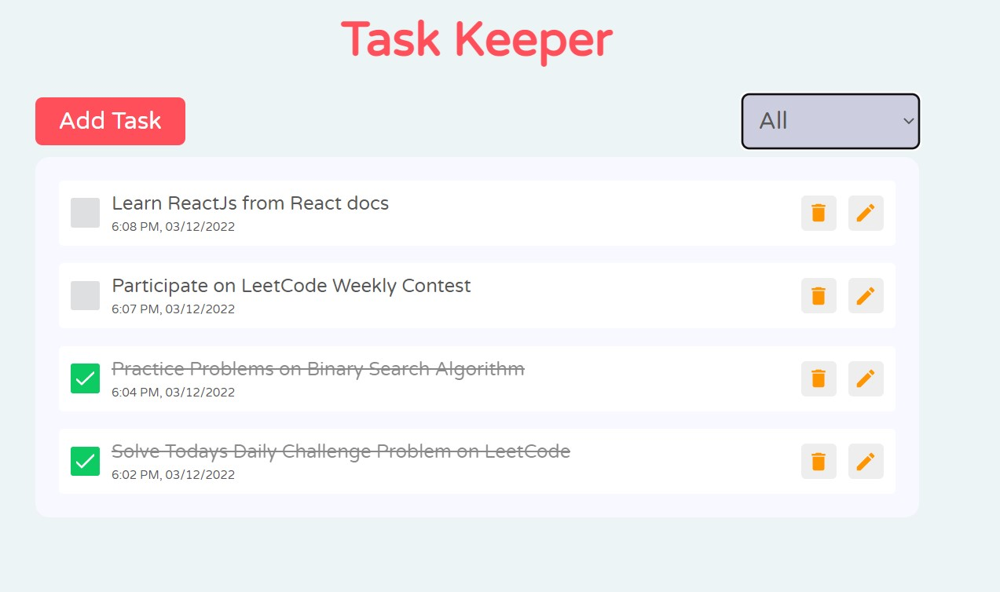

# Task Keeper

The Task Keeper is a responsive React application that helps you track your daily tasks. It provides features such as task editing, deletion, sorting by time and date, filtering, and a refresh button that does not cause any changes to the data. The app utilizes React Hooks, Redux, Hot Toast, Icons, and Framer Motion to create an attractive and interactive user interface.

## Installation

1. Clone the repository: `git clone https://github.com/Miraj8280/Task-Keeper.git`
2. Navigate to the project directory: `cd task-keeper`
3. Install the dependencies: `npm install`

## Usage

1. Start the development server: `npm start`
2. Open your browser and visit `http://localhost:3000` to access the Task Keeper.

## Features

- Task Management: Add, edit, and delete tasks to keep track of your daily activities.
- Sorting: Tasks are automatically sorted by time and date for easy organization.
- Filtering: Use the filter functionality to view tasks based on Completed/Incomplete/All.
- Refresh Button: Clicking the refresh button does not cause any changes to the data.

## Technologies Used

- React
- React Hooks
- Redux
- Hot Toast
- Framer Motion

## Happy Coding!

